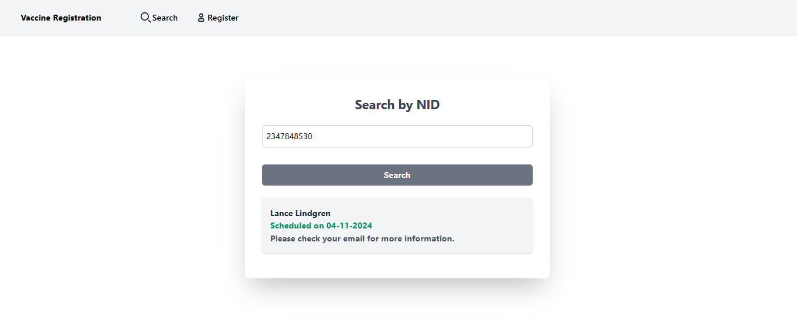
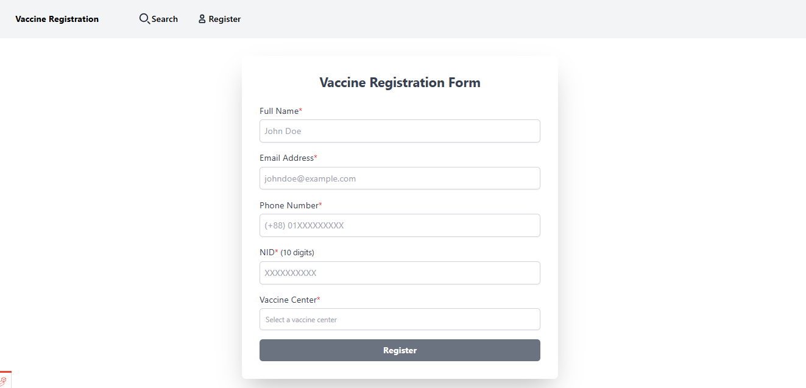

# Vaccine Registration System

## Table of Contents
- [Introduction](#introduction)
- [Features](#Features)
- [Installation](#installation)
- [Mail Configuration](#mail-configuration)
- [Queue Configuration](#queue-configuration)
- [Scheduled Tasks](#scheduled-tasks)
- [Screenshots](#Screenshots)

## Introduction
This is a Laravel project that demonstrates a vaccine registration system where candidates can register for their vaccination and can choose their prefered vaccine center. Candidates can also search their vaccination status by using NID.

## Features
- Candidates must select a Vaccine center at the time of registration.
- Every vaccine center has a limit of how many candidates they can serve in a single day (the limit can be varied from center to center).
- Distribute the registered people to vaccine centers and schedule their vaccination date based on ‘first come first serve’ strategy.
- Send a notification email to the candidates at 9 PM before the night of their scheduled vaccination date.
- Schedule vaccination only for the weekdays (Sunday to Thursday).
- Created a search page where candidates can enter their NID and see the status. The statuses can be `Not registered`, `Not scheduled`, `Scheduled`, `Vaccinated`. The following statuses will show after the search:
    - If the candidate is not registered yet, will show `Not registered` status along with a link to the ‘registration’ page.
    - If the candidate's vaccination date is scheduled, will show `Scheduled` status along with the scheduled date.
    - If the candidate is registered but not scheduled for vaccine yet, will show `Not scheduled` status.
    - Assume that every candidate will take their vaccine on their scheduled date. Then it will Show the `Vaccinated` status if the scheduled date is passed the current date.

## Installation

Follow the steps below to set up your environment.

    
    git clone https://github.com/mazhar-rony/vaccine-registration-system.git
    cd vaccine-registration-system
    composer install
    cp .env.example .env
    php artisan key:generate
    php artisan migrate:fresh --seed
    npm install
    npm run dev
    

## Mail Configuration

To configure your mail settings, update the following values in your `.env` file:

    
    MAIL_MAILER=smtp
    MAIL_HOST=smtp.mailtrap.io
    MAIL_PORT=2525
    MAIL_USERNAME=your_username
    MAIL_PASSWORD=your_password
    MAIL_ENCRYPTION=tls
    MAIL_FROM_ADDRESS=noreply@example.com
    MAIL_FROM_NAME="${APP_NAME}"
    

## Queue Configuration

Update your `.env` file:

    
    QUEUE_CONNECTION=database
    

### Running the Queue Worker

    
    php artisan queue:work
    

## Scheduled Tasks

To run the scheduled tasks locally, use the following command in your terminal:

    
    php artisan schedule:work
    

## Screenshots

Search vaccination status by NID

Candidate registration form

